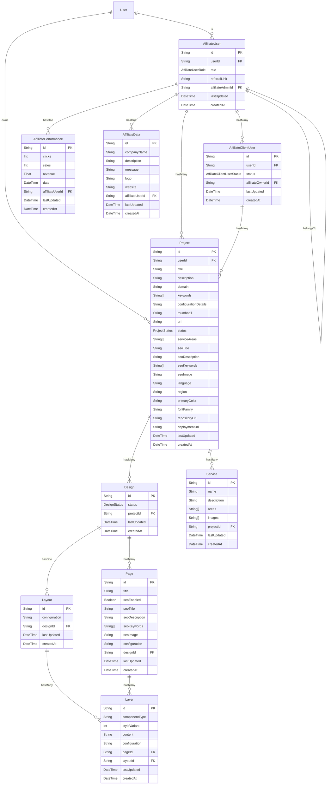

```mermaid
erDiagram
    User ||--o{ Project : "owns"
    User ||--o{ AffiliateUser : "is"
    AffiliateUser {
        String id PK
        String userId FK
        AffiliateUserRole role
        String referralLink
        String affiliateAdminId FK
        DateTime lastUpdated
        DateTime createdAt
    }
    AffiliateUser ||--o{ AffiliateClientUser : "hasMany"
    AffiliateUser ||--o{ Project : "hasMany"
    AffiliateUser ||--o{ AffiliatePerformance : "hasOne"
    AffiliateUser ||--o{ AffiliateData : "hasOne"
    AffiliateUser ||--|| AffiliateUser : "belongsTo"

    AffiliateClientUser {
        String id PK
        String userId FK
        AffiliateClientUserStatus status
        String affiliateOwnerId FK
        DateTime lastUpdated
        DateTime createdAt
    }
    AffiliateClientUser ||--o{ Project : "hasMany"

    Project {
        String id PK
        String userId FK
        String title
        String description
        String domain
        String[] keywords
        String configurationDetails
        String thumbnail
        String url
        ProjectStatus status
        String[] serviceAreas
        String seoTitle
        String seoDescription
        String[] seoKeywords
        String seoImage
        String language
        String region
        String primaryColor
        String fontFamily
        String repositoryUrl
        String deploymentUrl
        DateTime lastUpdated
        DateTime createdAt
    }
    Project ||--o{ Design : "hasMany"
    Project ||--o{ Service : "hasMany"

    Service {
        String id PK
        String name
        String description
        String[] areas
        String[] images
        String projectId FK
        DateTime lastUpdated
        DateTime createdAt
    }

    Design {
        String id PK
        DesignStatus status
        String projectId FK
        DateTime lastUpdated
        DateTime createdAt
    }
    Design ||--o{ Layout : "hasOne"
    Design ||--o{ Page : "hasMany"

    Layout {
        String id PK
        String configuration
        String designId FK
        DateTime lastUpdated
        DateTime createdAt
    }
    Layout ||--o{ Layer : "hasMany"

    Page {
        String id PK
        String title
        Boolean seoEnabled
        String seoTitle
        String seoDescription
        String[] seoKeywords
        String seoImage
        String configuration
        String designId FK
        DateTime lastUpdated
        DateTime createdAt
    }
    Page ||--o{ Layer : "hasMany"

    Layer {
        String id PK
        String componentType
        Int styleVariant
        String content
        String configuration
        String pageId FK
        String layoutId FK
        DateTime lastUpdated
        DateTime createdAt
    }

    AffiliatePerformance {
        String id PK
        Int clicks
        Int sales
        Float revenue
        DateTime date
        String affiliateUserId FK
        DateTime lastUpdated
        DateTime createdAt
    }

    AffiliateData {
        String id PK
        String companyName
        String description
        String message
        String logo
        String website
        String affiliateUserId FK
        DateTime lastUpdated
        DateTime createdAt
    }
```
